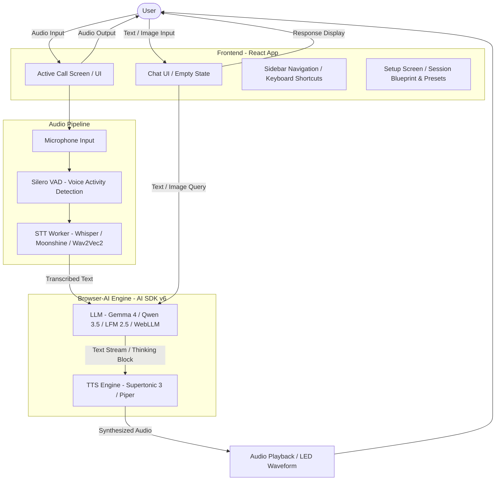

# WebVoice Studio — In-Browser Voice AI (Chat, TTS & STT)

A fully local voice AI workbench in your browser — conversational chat, text-to-speech, and speech-to-text. Speech recognition, LLM, and TTS all run on-device using WebGPU — no API keys, no server, no data leaves your device.

## What Makes This Different

**Everything runs in your browser:**

- **Speech-to-Text**: Whisper, Distil-Whisper, Moonshine, or Wav2Vec2 — all via WebGPU/WASM (optional — disable for text-only chat)
- **Voice Activity Detection**: Silero VAD detects when you're speaking with a robust memory management/tensor disposal flow
- **LLM**: Gemma 4 E2B, Liquid LFM 2.5 (230M/350M) via custom kernels, Qwen 3.5 (0.8B/2B/4B) via WebGPU, or Qwen/Llama via WebLLM (integrated via AI SDK v6)
- **Text-to-Speech**: **Supertonic 3** (multilingual) or **Piper** (lightweight per-voice models) — optional for text-only mode
- **Hindi typing**: Roman-to-Devanagari input via [Lipilekhika](https://www.npmjs.com/package/lipilekhika) in the message box
- **Active Call Screen**: Immersive fullscreen voice call screen showing pulsing ring animations and shared user/assistant waveforms
- **Sidebar & Shortcuts**: Collapsible sidebar navigation for quick switching between studios with keyboard shortcuts (`Cmd+B` on macOS, `Ctrl+B` on Windows/Linux)
- **UI Aesthetics**: Obsidian Signal design system featuring emerald accents, glassmorphic panels, and animated ambient drift backgrounds
- **Performance Presets**: Instant setup presets (Fast & Light, Balanced, Flagship) alongside collapsible advanced settings for fine-grained LLM parameter configuration
- **Markdown & Thinking Blocks**: Real-time rendering of LLM thinking blocks and markdown content with a dedicated syntax-highlighting code block viewer and copy-to-clipboard functionality

No data leaves your device. No API keys needed. Pick your models on the setup screen, then talk or type.

## Architecture Overview

WebVoice Studio operates entirely in-browser, combining WebGPU/WASM acceleration, low-latency audio processing, and modular model orchestration. The application processes voice input locally, routes transcripts through local LLMs, and synthesizes audio streams sentence-by-sentence in real time.



## Three Studios

The app is split into three tabs under **WebVoice Studio**:

| Tab             | Purpose                                                                               |
| --------------- | ------------------------------------------------------------------------------------- |
| **Voice Agent** | Full conversational assistant — voice call, push-to-talk, or text + image input       |
| **TTS Studio**  | Standalone text-to-speech sandbox — type text, pick engine/voice, synthesize and play |
| **STT Studio**  | Standalone speech-to-text — record mic audio or upload a file, get a transcript       |

Each studio loads models on demand with progress tracking. Switching away from Voice Agent ends an active call or mic session.

## Modes

### Voice Mode (STT + TTS enabled)

Hands-free or push-to-talk conversation. The LLM uses a concise voice persona (short answers, no markdown). TTS streams sentence-by-sentence as the model generates text. An LED-matrix waveform player shows playback in each assistant bubble. Displays an immersive, fullscreen calling screen during active sessions.

Includes a manual STT **Force Submit** button to instantly transcribe and send captured audio, as well as a **Stop** button in the control bar to halt generation.

### Text-to-Voice Mode

Type text queries but receive synthesized audio responses. This mode is ideal for environments where you cannot speak aloud but still want to listen to the agent's output.

### Text-only Mode (STT and/or TTS disabled)

Type messages (and optionally attach images with Gemma 4 or Qwen 3.5). The LLM uses a richer text persona — longer answers, markdown, lists, and code blocks. No microphone is required. The thinking process is rendered as a collapsible markdown block with custom syntax highlighting for code segments.

### Hindi & Hinglish

- **Supertonic 3**: Auto-detect, English, Hindi, or Hinglish output language
- **LLM**: Replies in the same language the user used (Hindi in Devanagari, English, or mixed Hinglish)
- **Voice persona**: System prompt adapts to the selected TTS voice gender (e.g. Hindi verb endings match female/male speaker)
- **Hindi typing**: Toggle Roman → Devanagari transliteration in the message box (auto-enabled for Hindi/Hinglish TTS language)

## Quick Start

```bash
pnpm install
pnpm dev
```

For production static export (e.g. HuggingFace Spaces):

```bash
pnpm build
# output in dist/
```

Open [http://localhost:5173](http://localhost:5173) in Chrome or Edge.

## What Downloads When

| Asset | Size | When | Cached |
|-------|------|------|--------|
| Moonshine Tiny | ~27 MB | First use (if STT enabled) | ✓ IndexedDB |
| Moonshine Base | ~61 MB | First use (if STT enabled) | ✓ IndexedDB |
| Whisper Tiny | ~75 MB | First use (if STT enabled) | ✓ IndexedDB |
| Whisper Base | ~145 MB | First use (if STT enabled) | ✓ IndexedDB |
| Distil-Whisper Small | ~150 MB | First use (if STT enabled) | ✓ IndexedDB |
| Wav2Vec2 Base | ~360 MB | First use (if STT enabled) | ✓ IndexedDB |
| Distil-Whisper Medium | ~350 MB | First use (if STT enabled) | ✓ IndexedDB |
| Whisper Small | ~480 MB | First use (if STT enabled) | ✓ IndexedDB |
| Distil-Whisper Large v3.5 | ~750 MB | First use (if STT enabled) | ✓ IndexedDB |
| Wav2Vec2 Large XLSR | ~1.2 GB | First use (if STT enabled) | ✓ IndexedDB |
| Silero VAD model | ~2 MB | First use (if STT enabled) | ✓ IndexedDB |
| Gemma 4 E2B LLM | ~3.2 GB | First use (if selected) | ✓ IndexedDB |
| Qwen 3.5 Models | ~800 MB–4 GB | First use (if selected) | ✓ IndexedDB |
| Liquid LFM 2.5 Models | ~230–350 MB | First use (if selected) | ✓ IndexedDB |
| WebLLM models | ~400 MB–2 GB | First use (if selected) | ✓ IndexedDB |
| Supertonic 3 TTS | ~400 MB | First use (if selected) | ✓ Cache API |
| Piper TTS voice | ~15–75 MB each | First use (if selected) | ✓ OPFS / browser cache |
| Voice styles (Supertonic) | ~300 KB each | On voice select | ✓ Memory |

First load downloads models based on your setup choices from HuggingFace CDN. After that, everything runs offline.

## Session Setup

On first launch, you configure your session blueprint using performance presets (**Fast & Light**, **Balanced**, **Flagship**) or adjust parameters manually through the collapsible **Advanced Settings** panel. Here, you choose the **LLM**, toggle **STT** and **TTS**, and configure specific engines and models. The session setup screen shows live download size estimates based on your blueprint selections.

Choices are saved in `localStorage` and can be reset from the setup screen or the debug panel. You can also switch LLM, STT model, voice, and language directly from the control bar during a session.

**Default LLMs**: Qwen 3.5 0.8B on desktop; Qwen 0.5B on iOS (due to WebGPU limitations).  
**Default STT Model**: Whisper Base (Multilingual) — offering a balanced compromise between download size and transcription accuracy.

## Requirements

- **Browser**: Chrome 113+ or Edge 113+ (WebGPU recommended for STT and TTS)
- **RAM**: ~6GB available for full voice stack (Gemma 4 E2B + STT + TTS); less for text-only or smaller WebLLM models
- **Microphone**: Required only when STT is enabled

TTS falls back to WASM if WebGPU is unavailable (Supertonic). Piper always uses WASM.

## STT engines

All engines run entirely in the browser via Transformers.js (ONNX Runtime). Choose based on size, speed, and language needs.

### Whisper

OpenAI Whisper models via `onnx-community/whisper-*`. Available in three sizes:

| Model         | Size    | Languages                    |
| ------------- | ------- | ---------------------------- |
| Whisper Tiny  | ~75 MB  | English-only or multilingual |
| Whisper Base  | ~145 MB | English-only or multilingual |
| Whisper Small | ~480 MB | English-only or multilingual |

### Distil-Whisper

Distilled Whisper variants — significantly smaller with comparable accuracy on English:

| Model                     | Size    | Languages    |
| ------------------------- | ------- | ------------ |
| Distil-Whisper Small      | ~150 MB | English-only |
| Distil-Whisper Medium     | ~350 MB | English-only |
| Distil-Whisper Large v3.5 | ~750 MB | Multilingual |

### Moonshine

[UsefulSensors/moonshine](https://github.com/usefulsensors/moonshine) — ultra-lightweight English ASR optimised for edge devices:

| Model          | Size   | Languages    |
| -------------- | ------ | ------------ |
| Moonshine Tiny | ~27 MB | English-only |
| Moonshine Base | ~61 MB | English-only |

### Wav2Vec2 / MMS

Facebook's CTC-based models — no autoregressive decoding, very fast inference:

| Model               | Size    | Languages    |
| ------------------- | ------- | ------------ |
| Wav2Vec2 Base       | ~360 MB | English-only |
| Wav2Vec2 Large XLSR | ~1.2 GB | Multilingual |

All engines share the same Silero VAD pipeline for voice activity detection.

## TTS engines

### Supertonic 3

Uses [Supertone/supertonic-3](https://huggingface.co/Supertone/supertonic-3) (~400MB engine + style files) via `onnxruntime-web`.

- **Languages**: Auto-detect, English, Hindi, or Hinglish
- **Voices**: 10 preset styles (F1–F5, M1–M5)
- **Inference**: WebGPU with WASM fallback

### Piper

Uses [@realtimex/piper-tts-web](https://github.com/therealtimex/piper-tts-web) with voices from [rhasspy/piper-voices](https://huggingface.co/rhasspy/piper-voices) (~60MB per voice).

- **Languages**: One language per voice (English US/UK, Hindi)
- **Inference**: WASM via ONNX Runtime Web
- Hindi voices load directly from rhasspy/piper-voices

## Project Structure

```
src/
├── App.tsx                         # Main shell: collapsible sidebar navigation, active page manager, and voice call overlays
├── main.tsx                        # Vite entry point
├── index.css                       # Obsidian Signal design system & styles
├── components/
│   ├── active-call-screen.tsx      # Full-screen calling UI with waveforms & status rings
│   ├── ambient-background.tsx      # Drifting glassmorphic orbs & mesh background
│   ├── audio-waveform-player.tsx   # LED-matrix audio player inside bubbles
│   ├── chat-empty-state.tsx        # Centered welcome panel with prompt suggestion templates
│   ├── code-block.tsx              # Syntax-highlighted code viewer with clipboard copy
│   ├── control-bar.tsx             # Call toggle, push-to-talk, stop button, and typing inputs
│   ├── conversation-area.tsx       # Message list, tool calls, thinking indicators
│   ├── hindi-typing-input.tsx      # Lipilekhika Roman-to-Devanagari input
│   ├── message-text.tsx            # Renders markdown-enabled chat responses & thinking logs
│   ├── page-transition.tsx         # Slide/fade page layout transition wraps
│   ├── setup-screen.tsx            # Modularized setup entry point routing to setup components
│   ├── stt-studio.tsx              # Standalone speech-to-text sandbox
│   ├── tts-studio.tsx              # Standalone text-to-speech sandbox
│   ├── setup/                      # Setup wizard, presets, advanced panel, and live blueprints
│   └── ui/                         # shadcn UI components
├── hooks/
│   ├── use-browser-ai-engine.ts    # Unified browser-ai execution harness (AI SDK v6)
│   ├── use-voice-agent.ts          # Main orchestrator for mic, VAD, STT, LLM, and TTS
│   ├── use-gemma4.ts               # Custom webgpu kernel harness for Gemma 4
│   ├── use-lfm2.ts                 # Custom webgpu kernel harness for Liquid LFM 2.5
│   ├── use-qwen35.ts               # Qwen 3.5 adapter wrapping use-browser-ai-engine
│   ├── use-webllm.ts               # WebLLM model adapter wrapping use-browser-ai-engine
│   └── use-tts.ts                  # Handles sentence streaming to TTS engines
└── lib/
    ├── system-prompt.ts            # Persona prompts & gender system alignments
    ├── tts-voices.ts               # Catalogs and settings for voice models
    ├── user-preferences.ts         # Handles browser storage configurations
    ├── voice-agent-types.ts        # Common voice agent types
    ├── llm/                        # Models catalog, stream parsers, AI SDK v6 engine logic
    ├── piper/                      # Rhasspy Piper voice sessions & WAV decoders
    ├── supertonic3/                # Supertonic 3 TTS engine configurations
    ├── tools/                      # In-browser system tool registry & executions
    └── tts-providers/              # Vendor drivers for Supertonic 3 & Piper

public/
├── stt-worker-esm.js               # STT worker (Whisper / Distil-Whisper / Moonshine / Wav2Vec2) + VAD
├── vad-processor.js                # Audio worklet
└── samples/                        # Sample WAV files for STT Studio testing (16-bit 16kHz mono)
```

## Using a Different LLM

**Qwen 3.5 0.8B** (`onnx-community/Qwen3.5-0.8B-ONNX-OPT`) and **Gemma 4 E2B** (`google/gemma-4-E2B-it-qat-mobile-transformers`) are supported on desktop via `@huggingface/transformers` with WebGPU.

**Liquid LFM 2.5** (230M/350M) runs locally via custom WebGPU kernels.

**WebLLM** models (Qwen 0.5B/1.5B, Llama 3.2 1B/3B) are selectable in the Advanced Settings or control bar. iOS defaults to Qwen 0.5B.

To use a remote API instead, replace the `llm.chat()` call in `use-voice-agent.ts` with a fetch to your endpoint.

## Tech Stack

- **Framework**: Vite, React 19, TypeScript
- **UI**: shadcn/ui, Tailwind CSS v4
- **STT**: Whisper, Distil-Whisper, Moonshine, Wav2Vec2 via @huggingface/transformers (ONNX Runtime Web)
- **VAD**: Silero VAD via ONNX Runtime
- **LLM**: Gemma 4 E2B & Qwen 3.5 via @huggingface/transformers (WebGPU ONNX); Liquid LFM 2.5 via custom kernels; Qwen & Llama via @mlc-ai/web-llm; integrated via AI SDK v6
- **TTS**: Supertonic 3 or Piper via onnxruntime-web / @realtimex/piper-tts-web
- **Markdown**: react-markdown + remark-gfm (rendering with syntax-highlighted code blocks)
- **Hindi input**: lipilekhika (Roman → Devanagari transliteration)

## License

MIT License — see [LICENSE](LICENSE)

## Credits

- [activated-intelligence/voice-chat](https://github.com/activated-intelligence/voice-chat) — voice pipeline foundation
- [Supertonic 3](https://github.com/supertone-inc/supertonic) — multilingual TTS engine
- [Piper](https://github.com/rhasspy/piper) / [rhasspy/piper-voices](https://huggingface.co/rhasspy/piper-voices) — lightweight TTS option
- [Whisper](https://github.com/openai/whisper) — OpenAI
- [Distil-Whisper](https://github.com/huggingface/distil-whisper) — Hugging Face
- [Moonshine](https://github.com/usefulsensors/moonshine) — Useful Sensors
- [Wav2Vec2](https://github.com/facebookresearch/fairseq/tree/main/examples/wav2vec) — Meta AI
- [Gemma 4 E2B ONNX](https://huggingface.co/onnx-community/gemma-4-E2B-it-ONNX) — default LLM
- [LFM 2.5 WebGPU Kernels demo](https://huggingface.co/spaces/webml-community/lfm2-webgpu-kernels) — reference implementation for LFM 2.5 WebGPU kernels
- [Gemma 4 WebGPU Kernels demo](https://huggingface.co/spaces/webml-community/gemma-4-webgpu-kernels) — reference implementation for Gemma 4 WebGPU kernels
- [WebLLM](https://github.com/mlc-ai/web-llm) — MLC AI (Qwen / Llama models)
- [Transformers.js](https://github.com/huggingface/transformers.js) — Hugging Face
- [Lipilekhika](https://www.npmjs.com/package/lipilekhika) — Hindi transliteration input
